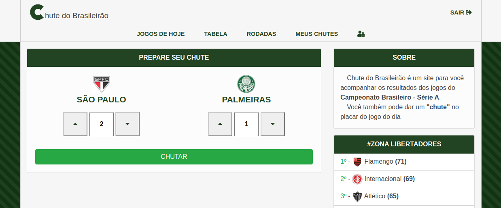

# Table of Contents

- [1. Introduction](#1.-introduction)
- [2. Campeonato Brasileiro de Futebol](#2.-campeonato-brasileiro-de-futebol)
- [3. Project Architecture](#3.-project-architecture)
  - [3.1. The dataset](#3.1.-the-dataset)
  - [3.2. Overview architecture](#3.2.-overview-architecture)
  - [3.3. Databases & the entity-relationship model](#3.3.-databases-&-the-entity-relationship-model)
  - [3.4. Tools, Libraries and 3º Services](#3.4.-tools-libraries-and-3º-services)
- [4. Getting started](#4.-getting-started)

  - [4.1. Prerequisites](#4.1.-prerequisites)
  - [4.2. Repositories](#4.2.-repositories)
  - [4.3. Updating the docker-compose.yml](#4.3.-updating-the-docker-compose.yml)
  - [4.4. Creating the Postgres database](#4.4.-creating-the-postgres-database)
  - [4.5. Running Docker](#4.5.-running-docker)
  - [4.6. Runnings specs](#4.7.-running-specs)

- [5. Usage](#5.-usage)
  - [5.1. UI](#5.1.-ui)
    - [5.1.1. Login](#5.1.1-login)
    - [5.1.2. Making a bet](#5.1.2.-making-a-bet)
    - [5.1.3. My bets](#5.1.3.-my-bets)
  - [5.2. API](#5.2.-api)
    - [5.2.1. Login](#5.2.1.-login)
    - [5.2.2. Requesting current rankings](#5.2.2.-requesting-current-rankings)

## 1. Introduction

_Note: First of all, this is more a personal portfolio than a open source project._

Chute do Brasileirão is a webpage where you can follow the Campeonato Brasileirio de Futebol rankings (also knonw as standings), next matches, previous matches, matches score and more. You can also make a guess on the score for the matches of the day.

The image below is the app's frontpage. In the main panel we can see informations about the championship's matches as such: today, next and previous matches, when and where they will happen, and the score from previous matches. On the sidebar we have information about the first six and the last four teams on the ranking.

## 2. Campeonato Brasileiro de Futebol

CBF (Campeonato Brasileiro de Futebol) is a brazilian soccer championship that happens once a year. The championship has many division (e.g A, B, C, etc). For the division A, 20 teams compete for the championship cup. To win the championship cup, each team must match, twice, with the others 19 teams (hence, the championship has in the total 380 matches). For each match, the winner gains 3 points or 1 point for ties. On the end of the 380 matches, the team with more points wins. For the last, the first six on the ranking of division A have the chance to compete on the Libertadores championship.

The image below is the app's Ranking page. Here we have informations about the teams and their rank on the current championship. We can also see informations for each team as: number of points, number of matches played, number of goals, next opponnent and more.

## 3. Project Architecture

First, let me talk about why I choose this project. I was looking, mainly, for a project where I could use a Message broker, even if it was a simple use case. I found in a blog the following example: server B scraps restaurant webpages for menu pricing, than sends to server A the results through the Message broker. I thought the idea cool, even if hosting two servers and one Message broker to exchange a little of data sound a little overkilling. But instead of scraping restaurants page I decided to scrap the CBF page.

### 3.1. The dataset

On the CBF page we have two sections where we can scrap data from the current championship: the ranking table (appers on the middle with the title _TABELA_ on the image below), and the matches grouped by round (on the right with the title _JOGOS_ on the image below). On the first section we extract the rank information for each team, but we also extract the teams. On the second section we extract the rounds and matches.

I created a gem [ScrapCbf](https://github.com/pedrogglima/scrap-cbf) to encapsulate the logic for extracting data. The gem consist of 3 points:

- mapping each entity (e.g rank, team, round and match).
- having the logic to extract their data (I'm using the gem Nokogiri to extract data from HTML);
- output the set of entities in a well known format (e.g json);

### 3.2. Overview architecture

As you can see on the image, we have two serves. On server A we build a monolith Ruby on Rails app where users can have access to html pages and the API. Still on server A, I'm using two databases: a RDS (Postgres DB) for saving the scrap data, and a no-sql, in-memory database (Redis DB) for caching the queries. I'm also using a background processing (Sidekiq) for two reason: first, for scheduling the scraping process and update the database with it; Second, for each new Team saved on the database I need to download and resize the team's image flag and, later, save them on the project's storage (Amazon S3).

The server B is used only to scrap the CBF official page for data from time to time. I'm not using any database for server B, hence, after scraping and formatting the data, server B must publishes it to the Message broker queue (RabbitMQ). Server A, listening on the same queue, acknowledges and consumes the data, attempting to save the data on the relational database.

For the last, a reverse proxy (Nginx) is placed between server A and the users. All these applications are running on Docker and orchestrated by Swarm.

_Note: this is the architecture for the project [chute-do-brasileirao-rabbitmq](https://github.com/pedrogglima/chute-do-brasileirao-rabbitmq). On this project I remove Server B and the Messege Broker. Now, Sidekiq fetches the scraping data and updates the database. To update the database with the data generate from [ScrapCbf](https://github.com/pedrogglima/scrap-cbf) I created a gem [ScrapCbfRecord](https://github.com/pedrogglima/scrap-cbf-record)._

### 3.3. Databases & the entity-relationship model

The dataset doesn't change frequently, usually every 24 hours, and it is relative small: it shouldn't use more than 100kb of Redis DB's memory for one championship. Even if we saved 10 years of data (10 championships), we would still use a relative small size of memory (~ 1mb). So, if the project's data was only consisted of scraped data, and if we didn't care about analysing the relationship between entities (e.g how many championships team Z participated, or how many matches team Z already played with team Y), using only Redis DB to store data would be a good choice for the project.

However, the project has others entries of data such as the ones added by the users, and these data have relations with the scraped data. Also, because of the nature of the app (analysing statistics of bets, winnings, etc), data consistency and a tool for querying data between relations is required by the project. Hence, we use a relational database to save the data and a no-sql, in memory database for performance reasons to solve the problem.

The image below we have the entity-relationship model for the project.

There aren't much to say here, the image says by itself. So I will only describe the meaning of the entities for the project. (If you want to see details about the tables, such as columns name, indexes, etc, you can check the config/schema.rb file).

- **Championship**: all the entities are related direct and indirect to it (e.g matches, rounds, guesses/bets). Also, every year we have a new championship.
- **Round**: the only purpose of this entity is map 10 matches. The championship has 38 rounds with 10 matches each, which sum up to 380 matches.
- **Match**: this entity represents the real matches between two teams, the place of the game, the date and time, the scores and everything else that can happen during the match.
- **Ranking**: this entity represent the team's ranking (also known as Standing) on the championship. It also has details about the teams and their matches played (e.g number of games, number of goals, number of vitories, next opponent, etc)
- **Division**: the CBF has many division, and I let it open to the future possibility of adding more divisions to the project - right now only division A is taking in count.
- **League**: as the same as division, I let it open to the possibility of adding others leagues besides the CBF.
- **Team**: this entity represents the real teams, with their names, flags image and, in the future, association with the entity player.
- **User**: kept it simple, one model to represent user and admin. Less complexity for authentication and everything else.
- **Bet**: this represents the guesses an user can give to a match. A better name for this entity would be 'bet_score' or 'bet_match_score', it helps identify the kind of bet it represents.
- **Global Setting**: I use the singleton pattern for this entity. It holds the global settings(e.g "which championship is occuring right now", or "should keep scraping data after championship finish"). The advantage of using a database table to hold the global settings, instead of using a file, is how easily is to change their values. No need for rebooting the server, and can be easily accessed and changed.

### 3.3. Tools, Libraries and 3º Services

- **Tools**: Ruby on Rails, StimulusJs, Bootstrap, Sidekiq, Nginx, Redis DB, Postgres DB, RabbitMQ, Docker, Swarm, Git.

- **Libraries**: (main gems) JWT, Devise, Omniauth-Twitter, Pundit, Haml, Faker, Rspec-rails, Shoulda-matchers, Factory_bot, etc.; (main packages) Bootstrap, Stimulus-carousel, Fontawesome.

- **3º Services**: DigitalOcean droplets, Amazon S3, Amazon Cloudfront.

## 4. Getting started

This project is formed by two repositories: This one, where we can find the most part of the codebase, and the [second repository](https://github.com/pedrogglima/chute-do-brasileirao-scraper.git), that has the lib used to scrap the CBF official page, and the logic to fetch and publish the data.

We will be running this on localhost as we don't have here the full settings for running on production.

### 4.1. Prerequisites

The only thing you will need to install are [Docker and Docker Compose](https://docs.docker.com/compose/install/).

_Note: Because we are creating the tools from Docker's images, there are no need for downloading tools or worry about version compatibility. But if you are insteresting into know the tools version, you can find them on the docker-composite file and Dockerfile on this same repository._

### 4.2. Repositories

    git clone https://github.com/pedrogglima/chute-do-brasileirao.git

and

    git clone https://github.com/pedrogglima/chute-do-brasileirao-scraper.git

_Note: To simplify the name for this repositories on the rest of this section, lets call them 'first repo' and 'second repo', respectively._

### 4.3. Updating the docker-compose.yml

The docker-compose file is found on the first repo. We need to update the path related to the second repo:

    Change all 'context: ../scraper/.' to 'context: path-to-the-second-repository/.')

We also need to create the env file, which contains the environment variables used to set up the tools and preferences. Inside the first repo:

    mkdir .env/development

Than add the following environment variables. Change the ones with '!...!' to values of your preference.

_Note: some of them you may need to subscribe on 3º services to get the credentials (e.g Twitter keys)._

    REDIS_CACHE=redis://redis_cache:6379/0
    DATABASE_HOST='!database!'
    POSTGRES_USER='!postgres!'
    POSTGRES_PASSWORD='add-some-long-secure-password'
    POSTGRES_DB='!add-the-database-name!'
    TWITTER_API_KEY='!add-your-twitter-api-key!'
    TWITTER_API_SECRET='!add-your-twitter-api-secret!'

### 4.4. Creating the Postgres database

Inside the first repo, runs:

    docker-compose run --rm app rails db:setup

Update the file db/seeds/1_users.rb with the informations of your admin user. After that, seed the database with the following command:

    docker-compose run --rm app rails db:reset

### 4.5. Running Docker

Inside the first repo, runs:

    docker-compose up

### 4.6. Running specs

Inside the first repo, runs:

    docker-compose exec app rails spec

## 5. Usage

In this section you will find examples of usage for the UI and API for this project.

### 5.1. UI

Here we will see how to login, to make a bet for the game of the day, and how to see all the user's bets.

#### 5.1.1. Login

Use one of the types to log in to the program: Twitter credentials or use your email address to create a new user.

_Note: updated - authentition via UI only using Twitter or Google credentials. The app doesn't allow create user accounts anymore._

#### 5.1.2. Making a bet

On this page you can make a bet. Users can only make bets to the matches of the day, and one bet per match. To make a bet it's only necessary that the user set the score for the teams.

#### 5.1.3. My bets

Here we have the users bets.

### 5.2. API

Here we have only the login and ranking example, but you can find more information on the folder app/controllers/api/v1/\*\* of this repository.

#### 5.2.1. Login

First, you need to get the Authorization Bearer token. You can do that by log in or sign in. e.g log in:

    {"email":"test@mail.com", "password":"password"}

Returns:

    {
       "id": 2,
       "email": "test/@mail.com",
       "first_name": "Test",
       "last_name": "Test",
       "created_at": "2020-10-20T11:07:27.645+03:00",
       "updated_at": "2020-10-25T23:33:34.050+02:00",
    }

Now, you can find your authorization bearer token inside Headers:

     Content-Type: application/json; charset=utf-8
     Transfer-Encoding: chunked
     Connection: keep-alive
     Status: 200 OK
     Cache-Control: max-age=0, private, must-revalidate
     Referrer-Policy: strict-origin-when-cross-origin
     Authorization: Bearer: eyJhbGciOiJIUzI1NiJ9...Uo2HAV7eY

#### 5.2.2. Requesting current rankings

You can make a GET request to https://localhost:3000/api/v1/tabelas passing the Authorization Bearer Token to the Header. You can use a http library (e.g curl) or the desktop client Postman to make the http request.

As a result you should see the following json.

     {
       "data": {
          "championship": {
            "id": 1,
            "year": 2020,
            "number_of_participants": 20,
            "league": {
              "id": 1,
              "name": "Campeonato Brasileiro",
              "division": {
                "id": 1,
                "name": "Série A"
              }
            }
          },
          "rankings": [
            {
              "ranking": {
                "id": 21,
                "position": 1,
                "points": 71,
                "played": 37,
                "won": 21,
                "drawn": 8,
                "lost": 8,
                "goals_for": 67,
                "goals_against": 46,
                "goal_difference": 21,
                "yellow_card": 87,
                "red_card": 3,
                "advantages": 63,
                "form": "EVV",
                "team": {
                  "id": 2,
                  "name": "Flamengo",
                  "state": "RJ",
                  "avatar_url": "https://conteudo.cbf.com.br/cdn/imagens/escudos/00006rj.jpg?v=2021021615"
                },
                "next_opponent": {
                  "id": 4,
                  "name": "São Paulo",
                  "state": "SP",
                  "avatar_url": "https://conteudo.cbf.com.br/cdn/imagens/escudos/00017sp.jpg?v=2021021615"
                }
              }
            },
            ...
          ]
        }
